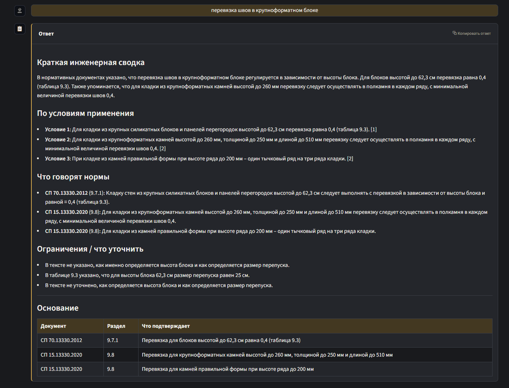
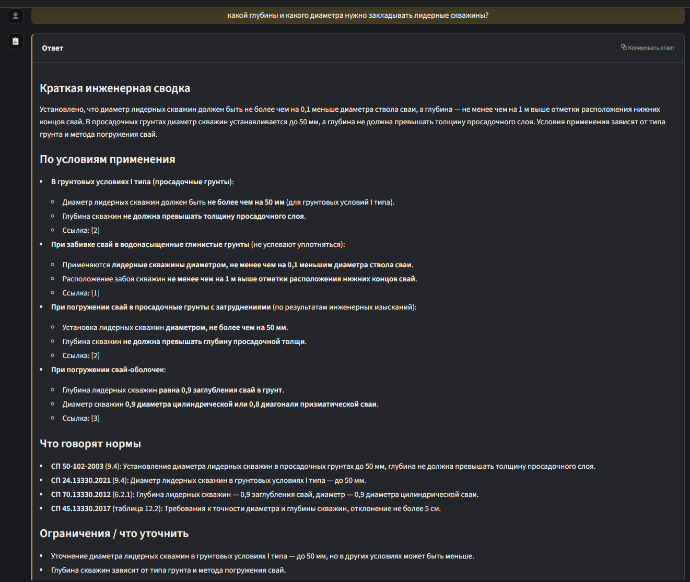
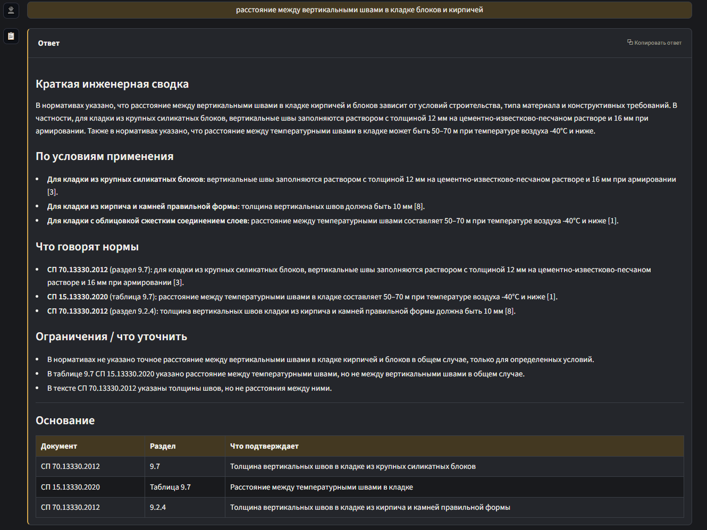

# EngineeringRAG

Локальная RAG-система для поиска ответов по нормативно-технической
документации в строительстве (далее НТД): СП, СНиП, ГОСТ выгруженных из систмемы "Техэксперт" и внутренним техническим
материалам.

EngineeringRAG помогает инженеру задать вопрос даже не зная НТД и найти
релевантные пункты норм и получить ответ с проверяемыми источниками. Система
не заменяет эксперта и не принимает проектные решения: ее задача - быстро
найти основание из нормативной базы.

> Статус: рабочая end-to-end система, развиваемая как open-source инженерный
> проект. В проекте есть пайплайн индексации документов, FastAPI retriever,
> Streamlit UI, история запросов, трассировка и offline-оценка качества на
> gold dataset.

## Коротко

| Возможность | Что внутри |
|-------------|------------|
| Локальная работа с НТД | PDF/Markdown загружаются в MinIO и индексируются в собственной инфраструктуре |
| Обработка сложных документов | MinerU OCR, Docling chunking, поддержка таблиц, формул и структурных ссылок |
| Гибридный поиск | BAAI/bge-m3 dense + sparse + ColBERT-векторы, Qdrant hybrid search и reranking |
| Контекст по связанным фрагментам | Расширение ответа по якорным ссылкаи, сметжным ссылкам и тиблицам |
| Проверяемый ответ | LLM формирует Markdown-ответ только по найденному контексту и указывает источники |
| Оценка качества | 200 экспертных вопросов в `docs/gold_dataset` |

---

## Зачем это нужно

Работа с НТД часто упирается не в отсутствие информации, а в трудность поиска:

- нужно заранее понимать, в каком документе искать;
- обычный поиск по PDF требует почти точного совпадения формулировки;
- универсальные LLM без привязки к базе документов могут уверенно ссылаться на
  несуществующие пункты норм;
- таблицы, формулы, приложения и внутренние ссылки плохо сочетаются в простым
  текстовым поиском.

EngineeringRAG решает эту задачу как локальный инженерный поиск. Документы
проходят OCR и структурный чанкинг, затем система ищет по смыслу и ключевым
словам. Итоговый ответ собирается только из
найденных фрагментов.

## Для кого

| Роль | Что получает |
|------|--------------|
| Инженер-проектировщик | Быстрый поиск пунктов НТД, таблиц и ограничений без ручного просмотра десятков PDF |
| ГИП / руководитель группы | Проверяемые основания для обсуждения проектных решений |
| Проектный институт с внутренними документами | Шаблон для RAG-системы без внешних API и с контролем над корпусом документов |

## Как выглядит

<table>
  <tr>
    <td width="50%">
      <strong>1. Вопрос в интерфейсе</strong><br>
      
    </td>
    <td width="50%">
      <strong>2. Ответ с источниками</strong><br>
      
    </td>
  </tr>
  <tr>
    <td width="50%">
      <strong>3. Ответ по перевязке швов</strong><br>
      
    </td>
    <td width="50%">
      <strong>4. Ответ по лидерным скважинам</strong><br>
      
    </td>
  </tr>
  <tr>
    <td colspan="2">
      <strong>5. Ответ по вертикальным швам</strong><br>
      
    </td>
  </tr>
</table>

## Что реализовано

| Возможность | Что это дает |
|-------------|--------------|
| Загрузка и обработка PDF из MinIO | Нормативы можно добавлять в единое локальное хранилище |
| OCR через MinerU | Извлечение текста, формул и таблиц из сложных PDF |
| Чанкинг через Docling | Сохранение структуры разделов, пунктов и таблиц |
| Обработка таблиц | Разделенные и крупные таблицы получают метаданные и отдельные окна поиска |
| Векторизация BAAI/bge-m3 | Dense, sparse и ColBERT-представления в одной модели |
| Qdrant hybrid search | Dense + sparse prefetch с ColBERT MaxSim rerank |
| Расширение контекста по ссылкам | Связанные таблицы, разделы и приложения можно подтянуть в контекст ответа |
| LLM переформулирование | Переформулирование пользовательского вопроса под поиск по НТД |
| LLM формирования ответа | Ответ в Markdown с опорой на найденные фрагменты |
| FastAPI сервис |Врутренний API для поиска, генерации ответа и трассировки запроса |
| Streamlit UI | Пользовательский интерфейс с примерами вопросов, историей и обратной связью |
| User API | Регистрация, сессии, настройки темы и история запросов |
| Логирование запросов | Трейсы сохраняются в PostgreSQL и MinIO |


## Архитектура

```text
PDF / Markdown
    |
    v
MinIO -> Airflow DAG -> MinerU OCR -> Docling chunking
    |                                      |
    |                                      v
    +------------------------------> enriched chunks
                                           |
                                           v
                               BAAI/bge-m3 embeddings
                         dense + sparse + ColBERT vectors
                                           |
                                           v
                                        Qdrant
                                           |
                                           v
User -> Streamlit UI -> retriever_api -> hybrid search + ref expansion
                            |              |
                            |              v
                            |         vllm-light / Qwen3-4B-AWQ
                            v
                         user_api / PostgreSQL
```

### Основные компоненты

| Компонент | Назначение |
|-----------|------------|
| `airflow/dags/batch_pipline.py` | Основной DAG индексации документов |
| `airflow/dags/batch_pipline_separated.py` | Разделенные режимы полного пайплайна и Docling-only |
| `services/retriever` | FastAPI-сервис поиска и генерации ответа |
| `services/user_api` | FastAPI-сервис пользователей, сессий и истории |
| `ui` | Streamlit-интерфейс |
| `compose.yaml` | Локальная инфраструктура: Airflow, MinIO, Qdrant, vLLM, PostgreSQL, RetrieverAPI |
| `docs/ML system design doc.md` | ML System Design Doc с постановкой задачи и обоснованием решений |

## Как работает поиск

1. Пользователь задает вопрос.
2. LLM переформулирует вопрос в более точную поисковую фразу.
3. Retriever строит dense, sparse и ColBERT-представления запроса.
4. Qdrant выполняет гибридный поиск.
5. ColBERT MaxSim пересортировывает кандидатов.
6. Система подтягивает связанные таблицы и разделы по `anchor_refs`,
   `cross_refs`, `table_id`.
7. Контекст упаковывается с учетом максимального размера контекста модели.
8. LLM формирует ответ только по переданным фрагментам.
9. Запрос, результаты, контекст и логи сохраняются для анализа качества.
10. Ответ от LLM, найденый контекст передается в UI.

## Оценка качества

Качество проверяется на [gold dataset](docs/gold_dataset) из 200 экспертных
вопросов по разделам АР, АС и КЖ. Для каждого вопроса задан эталонный ответ,
нормативный документ, раздел или таблица и подтверждающий фрагмент источника.

Методика расчета реализована в
[`services/retriever/app/metrics`](services/retriever/app/metrics). Retrieval
метрики показывают, на каком этапе пайплайна найден нужный evidence:
в прямой выдаче, после расширения ссылок или уже в финальном контексте для LLM.
Generation метрики считаются через LLM-as-judge по вопросу, найденному
контексту и итоговому ответу.

| Метрика | Значение |
|---------|----------|
| Вопросов | 200 |
| `de_recall@5` | 0.85 |
| `de_recall@10` | 0.92 |
| `ee_recall` | 0.85 |
| `ce_recall` | 0.83 |
| `MRR` | 0.69 |
| `faithfulness` | 0.93 |
| `answer_relevance` | 0.95 |

Коротко о метриках:

- `de_recall` - нужный фрагмент найден в прямой поисковой выдаче;
- `ee_recall` - нужный фрагмент найден после расширения по ссылкам и таблицам;
- `ce_recall` - нужный фрагмент попал в финальный контекст для генерации;
- `MRR` - насколько близко к началу выдачи расположен первый релевантный
  фрагмент;
- `faithfulness` - насколько ответ подтвержден найденным контекстом;
- `answer_relevance` - насколько ответ отвечает на исходный вопрос.

## Где это применимо

- Локальный поиск по СП, ГОСТ, СНиП и внутренним техническим регламентам.
- Быстрая подготовка проверяемых оснований для проектных решений.
- Внутренний ассистент для инженерной команды, где документы нельзя отправлять
  во внешние API.

## Возможные пути развития

EngineeringRAG можно развивать не только как вопросно-ответный поиск, но и как
базу для AI-сценариев вокруг проектной документации:

- проверка пояснительных записок на актуальность ссылок на нормы;
- поиск устаревших, некорректных или неподтвержденных ссылок на СП, ГОСТ и
  СНиП;
- проверка текста на соответствие принятым практикам проектной организации;
- выделение спорных мест, отсутствующих оснований и технических рисков;
- AI-ревью проектной документации с отчетом и цитатами из актуальной базы;
- ассистент для нормоконтроля и внутреннего технического аудита.

Технические направления развития:

- передача изображений из payload в контекст ответа;
- metadata database для отслеживания файлов в MinIO;
- автоматическое обновление индекса при изменении документов;
- перевод проблемных частей MinerU на более устойчивую очередь;
- оптимизация Docker images и потребления памяти;
- расширение A/B-оценки поисковых конфигураций;
- улучшение обработки таблиц и ссылок на приложения.

## Технический стек

- Python 3.12
- FastAPI, Pydantic, SQLAlchemy async
- Streamlit
- Airflow 3.2
- MinIO
- Qdrant
- PostgreSQL
- MinerU
- Docling Serve
- BAAI/bge-m3
- Qwen/Qwen3-4B-AWQ через vLLM OpenAI-compatible API
- Docker Compose

## Системные требования

Рекомендуемая конфигурация для локального запуска:

| Ресурс | Рекомендация |
|--------|--------------|
| GPU | NVIDIA RTX 3060 или выше |
| VRAM | 12 GB+ |
| RAM | 32 GB+ |
| Disk | 100 GB+ SSD |
| OS | Linux с Docker и NVIDIA Container Toolkit |

Обработка документов и online-поиск не выполняться одновременно.
Для работы на одной GPU с ограниченной VRAM, требуется отключение части сервисов для работы других.


## Быстрый старт

### 1. Склонировать репозиторий

```bash
git clone https://github.com/dvedd/EngineeringRAG
cd EngineeringRAG
```
### 2. Подготовить Linux-хост

```bash
sudo bash scripts/setup-linux.sh
```

Скрипт устанавливает Docker, NVIDIA Container Toolkit, CUDA-зависимости и
создает локальную структуру `data/`.


### 3. Создать `.env`

Минимальный пример для локального запуска:

```env
AIRFLOW_UID=1000
AIRFLOW_GID=1000
AIRFLOW__API__SECRET_KEY=change-me

MINIO_ROOT_USER=minioadmin
MINIO_ROOT_PASSWORD=minioadmin

TRACE_MINIO_ACCESS_KEY=trace_logger
TRACE_MINIO_SECRET_KEY=change-me
TRACE_MINIO_BUCKET=ragfiles

HF_TOKEN=
LIGHT_MODEL=Qwen/Qwen3-4B-AWQ
```

Для постоянного окружения замените значения `change-me` на реальные секреты.

### 4. Запустить backend-сервисы поиска

```bash
# Запустить базовые сервисы и сервисы поиска
docker compose --profile base --profile search up -d

# Запустить только базовые сервисы
docker compose --profile base up -d

# Запустить только сервисы поиска
docker compose --profile search up -d

# Запустить только сервисы обработки данных
docker compose --profile base --profile processing up -d
```

### 5. Запустить Streamlit UI

UI запускается локально поверх backend-сервисов:

```bash
python -m venv .venv
source .venv/bin/activate
pip install -r requirements.txt

streamlit run ui/app.py --server.port 8501
```

После запуска UI будет доступен на `http://localhost:8501`.

## Списаок одресов

| Сервис | URL |
|--------|-----|
| Streamlit UI | `http://localhost:8501` |
| Retriever API | `http://localhost:9123` |
| User API | `http://localhost:9130` |
| vLLM light | `http://localhost:8020` |
| Qdrant | `http://localhost:6333` |
| MinIO API | `http://localhost:9000` |
| MinIO Console | `http://localhost:9001` |
| Airflow UI | `http://localhost:8080` |
| Docling Serve | `http://localhost:5001` |
| Superset | `http://localhost:5054` |

## Пример API-запроса

```bash
curl -X POST http://localhost:9123/search \
  -H "Content-Type: application/json" \
  -d '{
    "query": "Как располагать стыки рабочей арматуры внахлестку?",
    "rewrite_system_prompt": "",
    "compose_system_prompt": "",
    "use_rewriter": false,
    "top_k": 4,
    "prefetch_k": 40,
    "mode": "hybrid"
  }'
```

## Ограничения

- Система не является источником истины: инженер обязан проверить первоисточник
  перед применением ответа в проекте.
- Качество зависит от полноты загруженной базы НТД.
- Таблицы поддерживаются, но остаются самым сложным типом контента.
- На одной RTX 3060 тяжелые операции лучше разводить по времени: обработку файлов
  и генерацию не обязательно держать одновременно.

## Контекст проекта

EngineeringRAG начинался как прикладная задача поиска по нормативной базе,
а сейчас развивается как самостоятельный open-source проект/инженерный кейс.
Основная ценность проекта - не отдельный чат-интерфейс, а полный контур работы
с документами: подготовка данных, индексация, retrieval, генерация ответа,
трассировка и измерение качества.

## Документация

- [ML System Design Doc](docs/ML%20system%20design%20doc.md)
- [Gold dataset](docs/gold_dataset)
- [Метрики качества](services/retriever/app/metrics)
- [Подготовка Linux](scripts/setup-linux.md)
