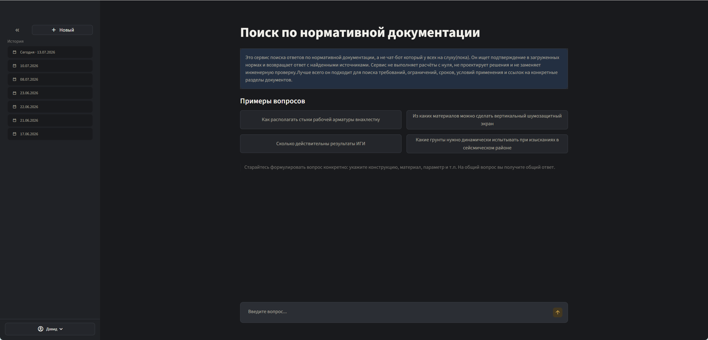
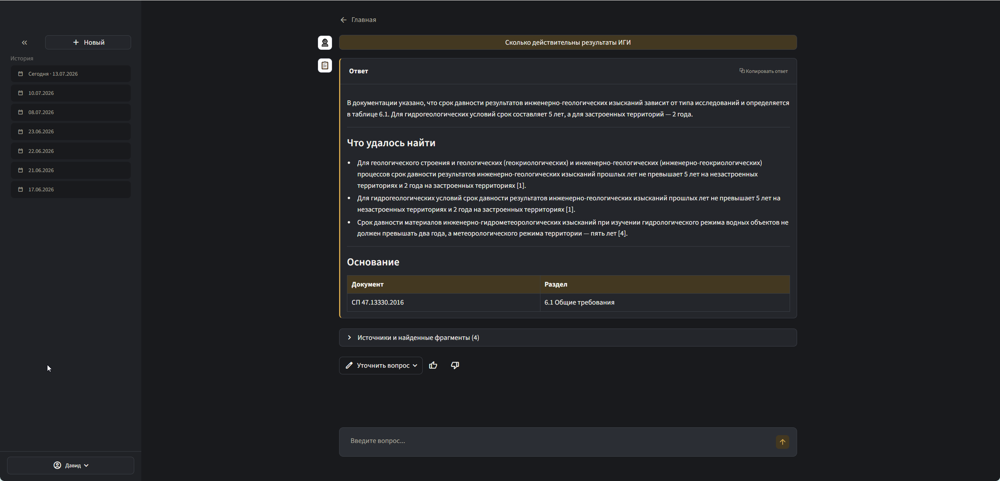

# EngineeringRAG

Локальная RAG-система для поиска ответов по нормативно-технической
документации в строительстве: СП, СНиП, ГОСТ и внутренним техническим
материалам.

Проект помогает инженеру задать вопрос обычным языком, найти релевантные
пункты норм и получить ответ с проверяемыми источниками. Система не заменяет
эксперта и не принимает проектные решения: ее задача - быстро поднять
основание из нормативной базы и показать, на чем оно держится.

> Статус: рабочий MVP для внутреннего пилота. Есть индексирующий пайплайн,
> FastAPI retriever, Streamlit UI, история запросов, логирование трассировки и
> baseline-оценка на экспертных вопросах.

---

## Зачем это нужно

Работа с НТД часто упирается не в отсутствие информации, а в трудность поиска:

- нужно заранее понимать, в каком документе искать;
- обычный поиск по PDF требует почти точного совпадения формулировки;
- универсальные LLM без привязки к базе документов могут уверенно ссылаться на
  несуществующие пункты норм;
- таблицы, формулы, приложения и внутренние ссылки плохо живут в простом
  текстовом поиске.

EngineeringRAG решает эту задачу как локальный инженерный поиск: документы
загружаются в собственную базу, проходят OCR и структурный чанкинг, после чего
поиск выполняется по смыслу, ключевым словам и late-interaction reranking.
Ответ формируется только на основе найденного контекста.

## Для кого

| Роль | Что получает |
|------|--------------|
| Инженер-проектировщик | Быстрый поиск пунктов НТД, таблиц и ограничений без ручного просмотра десятков PDF |
| ГИП / руководитель группы | Проверяемые основания для обсуждения проектных решений |
| Технический специалист | Понятную локальную RAG-архитектуру с Airflow, Qdrant, FastAPI и vLLM |
| Нетехнический заказчик пилота | Инструмент, который снижает время поиска и риск ссылок на выдуманные нормы |

## Как выглядит





## Что уже реализовано

| Возможность | Что это дает |
|-------------|--------------|
| Загрузка и обработка PDF из MinIO | Нормативы можно добавлять в единое хранилище |
| OCR через MinerU | Извлечение текста, формул и таблиц из сложных PDF |
| Чанкинг через Docling | Сохранение структуры разделов, пунктов и таблиц |
| Обработка таблиц | Разделенные и крупные таблицы получают метаданные и отдельные окна поиска |
| Векторизация BAAI/bge-m3 | Dense, sparse и ColBERT-векторы в одной модели |
| Qdrant hybrid search | Dense + sparse prefetch с ColBERT MaxSim rerank |
| Расширение контекста по ссылкам | Если пункт ссылается на таблицу или раздел, система может подтянуть связанный фрагмент |
| LLM query rewriter | Переформулирование пользовательского вопроса под поиск по НТД |
| LLM answer composer | Ответ в Markdown с опорой на найденные фрагменты |
| FastAPI retriever service | API для поиска, генерации ответа и трассировки запроса |
| Streamlit UI | Пользовательский интерфейс с примерами вопросов, историей и обратной связью |
| User API | Регистрация, сессии, настройки темы и история запросов |
| Логирование запросов | Сохраняются в PostgreSQL и MinIO |
| Offline evaluation | Метрики retrieval/generation на наборе экспертных вопросов |

## Архитектура

```text
PDF / Markdown
    |
    v
MinIO -> Airflow DAG -> MinerU OCR -> Docling chunking
    |                                      |
    |                                      v
    +------------------------------> enriched chunks
                                           |
                                           v
                               BAAI/bge-m3 embeddings
                         dense + sparse + ColBERT vectors
                                           |
                                           v
                                        Qdrant
                                           |
                                           v
User -> Streamlit UI -> retriever_api -> hybrid search + ref expansion
                            |              |
                            |              v
                            |         vllm-light / Qwen3-4B-AWQ
                            v
                         user_api / PostgreSQL
```

### Основные компоненты

| Компонент | Назначение |
|-----------|------------|
| `airflow/dags/batch_pipline.py` | Основной DAG индексации документов |
| `airflow/dags/batch_pipline_separated.py` | Разделенные режимы полного пайплайна и Docling-only |
| `services/retriever` | FastAPI-сервис поиска и генерации ответа |
| `services/user_api` | FastAPI-сервис пользователей, сессий и истории |
| `ui` | Streamlit-интерфейс для пилота |
| `compose.yaml` | Локальная инфраструктура: Airflow, MinIO, Qdrant, vLLM, PostgreSQL, Superset |
| `docs/ML system design doc.md` | ML System Design Doc с постановкой задачи и обоснованием решений |

## Поисковый пайплайн

1. Пользователь задает вопрос.
2. LLM переформулирует вопрос в более точную поисковую фразу.
3. Retriever строит dense, sparse и ColBERT-представления запроса.
4. Qdrant выполняет dense + sparse prefetch.
5. ColBERT MaxSim пересортировывает кандидатов.
6. Система подтягивает связанные таблицы и разделы по `anchor_refs`,
   `cross_refs`, `table_id`.
7. Контекст упаковывается с учетом максимального размера контекста модели в 10.000.
8. LLM формирует ответ только по переданным фрагментам.
9. Запрос, результаты, контекст и логи сохраняются для анализа качества.

## Текущий baseline качества

Оценка ведется на наборе из 200(не провалидированных) "экспертных" вопросов из
`services/retriever/app/eval/data`.

Последний прогон с query rewriter, генерацией ответа и `hybrid` retrieval:

| Метрика | Значение |
|---------|----------|
| Вопросов | 200 |
| `de_recall_at_5` | 0.535 |
| `de_recall_at_10` | 0.585 |
| `ee_recall` до упаковки контекста | 0.595 |
| `ce_recall` в финальном контексте | 0.550 |
| `mrr` | 0.439 |
| `faithfulness_score` | 0.862 |
| `answer_relevance_score` | 0.911 |

Эти метрики - инженерный baseline, а не финальный SLA. Цель пилота: собрать
реальные вопросы отдела, экспертные оценки и довести качество поиска до стабильного уровня.

## Цели пилота

- Проверить экономию времени на поиске оснований в НТД.
- Проверить, насколько часто система находит нужный пункт среди первых
  результатов.
- Отследить случаи, где ответ неполный, не подтвержден контекстом или зависит
  от формулировки вопроса.
- Накопить корпус реальных вопросов и экспертных оценок для донастройки.
- Принять решение: оставить инструмент внутренним помощником отдела или
  развивать как инженерный ИТ-продукт.

Целевые ориентиры пилота:

| Критерий | Цель |
|----------|------|
| Ответ содержит проверяемый источник | >= 90% |
| Галлюцинации со ссылкой на несуществующий пункт | 0 критичных случаев |
| Нужный пункт найден среди предложенных вариантов | >= 75% |
| Экспертная полезность ответа | >= 4/5 |
| Время ответа на целевом железе | до 1-2 минут |

## Технический стек

- Python 3.12
- FastAPI, Pydantic, SQLAlchemy async
- Streamlit
- Airflow 3.2
- MinIO
- Qdrant
- PostgreSQL
- MinerU
- Docling Serve
- BAAI/bge-m3
- Qwen/Qwen3-4B-AWQ через vLLM OpenAI-compatible API
- Docker Compose

## Системные требования

Рекомендуемая конфигурация для локального пилота:

| Ресурс | Рекомендация |
|--------|--------------|
| GPU | NVIDIA RTX 3060 или выше |
| VRAM | 12 GB+ |
| RAM | 32 GB+ |
| Disk | 100 GB+ SSD |
| OS | Linux с Docker и NVIDIA Container Toolkit |

Индексация документов, OCR и online-поиск не обязаны выполняться одновременно.
Это важно для работы на одной GPU с ограниченной VRAM.

## Быстрый старт

### 1. Подготовить Linux-хост

```bash
sudo bash scripts/setup-linux.sh
```

Скрипт устанавливает Docker, NVIDIA Container Toolkit, CUDA-зависимости и
создает локальную структуру `data/`.

### 2. Склонировать репозиторий

```bash
git clone https://github.com/dvedd/EngineeringRAG
cd EngineeringRAG
```

### 3. Создать `.env`

Минимальный пример для локального запуска:

```env
AIRFLOW_UID=1000
AIRFLOW_GID=1000
AIRFLOW__API__SECRET_KEY=change-me

MINIO_ROOT_USER=minioadmin
MINIO_ROOT_PASSWORD=minioadmin

TRACE_MINIO_ACCESS_KEY=trace_logger
TRACE_MINIO_SECRET_KEY=change-me
TRACE_MINIO_BUCKET=ragfiles

HF_TOKEN=
LIGHT_MODEL=Qwen/Qwen3-4B-AWQ
```

Для постоянного окружения замените значения `change-me` на реальные секреты и
не коммитьте `.env`.

### 4. Запустить backend-сервисы поиска

```bash
docker compose up -d
```

### 5. Запустить Streamlit UI

UI сейчас запускается локально поверх backend-сервисов:

```bash
cd ui
python -m venv .venv
source .venv/bin/activate
pip install -r requirements.txt

RETRIEVER_API_URL=http://127.0.0.1:9123 \
USER_API_URL=http://127.0.0.1:9130 \
streamlit run app.py
```

После запуска UI будет доступен на `http://localhost:8501`.

## Полезные адреса

| Сервис | URL |
|--------|-----|
| Streamlit UI | `http://localhost:8501` |
| Retriever API | `http://localhost:9123` |
| User API | `http://localhost:9130` |
| vLLM light | `http://localhost:8020` |
| Qdrant | `http://localhost:6333` |
| MinIO API | `http://localhost:9000` |
| MinIO Console | `http://localhost:9001` |
| Airflow UI | `http://localhost:8080` |
| Docling Serve | `http://localhost:5001` |
| Superset | `http://localhost:5054` |

## Пример API-запроса

```bash
curl -X POST http://localhost:9123/search \
  -H "Content-Type: application/json" \
  -d '{
    "query": "Как располагать стыки рабочей арматуры внахлестку?",
    "rewrite_system_prompt": "",
    "compose_system_prompt": "",
    "use_rewriter": false,
    "top_k": 4,
    "prefetch_k": 40,
    "mode": "hybrid"
  }'
```

## Ограничения

- Система не является источником истины: инженер обязан проверить первоисточник
  перед применением ответа в проекте.
- Качество зависит от полноты загруженной базы НТД и качества OCR.
- Таблицы и формулы поддерживаются, но остаются самым сложным типом контента.
- На одной RTX 3060 нельзя комфортно держать все тяжелые операции одновременно:
  OCR, индексацию и генерацию лучше разводить по времени.
- Текущий UI не упакован в Docker Compose как отдельный сервис.

## Roadmap

Ближайшие улучшения:

- передача изображений из payload в контекст ответа;
- metadata database для отслеживания файлов в MinIO;
- автоматическое обновление индекса при изменении документов;
- перевод проблемных частей MinerU на более устойчивую очередь;
- оптимизация Docker images и потребления памяти;
- расширение A/B-оценки поисковых конфигураций;
- улучшение обработки таблиц, формул и ссылок на приложения.

## Документация

- [ML System Design Doc](docs/ML%20system%20design%20doc.md)
- [Подготовка Linux](scripts/setup-linux.md)
