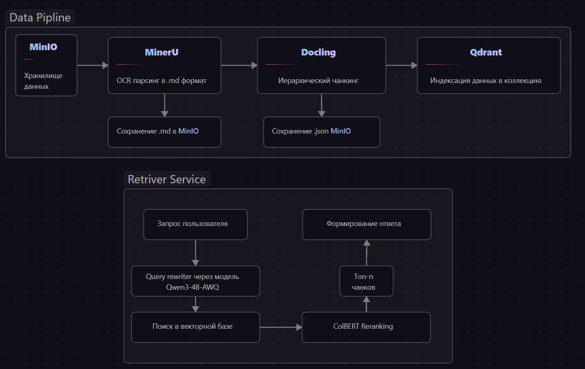

# ML System Design Doc

## Дизайн ML системы — ConstructionRAG (MVP v1)

> **Проект:** Локальная RAG-система для поиска по нормативно-техническим документам (СП, СНиП, ГОСТ)  
> **Автор:** Давид Медведев  
> **Версия:** MVP 1.1  
> **Дата:** Май 2026  

---

## Термины и сокращения

| Термин | Расшифровка |
|--------|-------------|
| RAG | Retrieval-Augmented Generation - генерация ответа LLM на основе контекста|
| НТД | Нормативно-техническая документация (СП, СНиП, ГОСТ) |
| Чанк | Фрагмент документа после разбиения |
| Dense embedding | Плотный векторный индекс запроса (семантический поиск) |
| Sparse / BM25 | Разреженный вектор ключевых слов |
| ColBERT rerank | Пересортировка кандидатов late-interaction методом |

---

## 1. Цели и предпосылки

### 1.1. Зачем нужна разработка?

**Проблема.** Работа с НТД — сложная и не интуитивная задача: специалистам необходимо вручную искать пункты в сотнях страниц СП, СНиП и ГОСТов. Использование поиска по документам или LLM «в чистом виде» не решает проблему — стандартный поиск ведется по полному совпадению, и, не зная точной формулировки НТД, ответ не найти. Модели LLM галлюцинируют, ссылаясь на несуществующие пункты нормативов. В практике команды был зафиксирован случай, когда конструктивное решение было отклонено из-за ссылки LLM на несуществующий пункт СП.

**Бизнес-цель.**  Сократить время получение ответа на вопрос из НТД с ручного поиска (15–30 минут) до автоматизированного ответа с точными цитатами (<1.5 минут). Повысить надежность работы с НТД за счет верифицированных ссылок на источники.

**Почему ML/RAG + LLM**
- Семантический поиск способен находить релевантные пункты, даже если формулировка вопроса отличается от текста норматива
- Ответ всегда сопровождается точной ссылкой на источник (документ + пункт)
- Система способна работать офлайн — запрос корпоративной среды.

---

### 1.2. Бизнес-требования и ограничения

**Требования к системе:**
- Система должна работать полностью офлайн (без обращений к внешним API).
- Ответ должен содержать цитату из документа и точное указание на источник (СП X.X.XXXX, пункт N.N).
- Поддержка работы с документами в формате PDF (включая изображения, формулы, таблицы), DOCX, TXT.
- Возможность добавлять новые документы в базу автоматически.
- Способность к масштабированию только за счет изменения параметров.

**Ограничения:**
- Аппаратная база: GPU-сервер, RTX 3060, 12 ГБ VRAM, 32 ГБ RAM
- Язык документов: русский
- Тип документов: строительные нормативы (СП, СНиП, ГОСТ), технические заметки специалистов

**Ожидания от MVP:**
- Обработка и индексация базы нормативной документации
- Интерфейс для задания вопросов на естественном языке
- Гибридный поиск с реранжированием
- Поддержка фильтрации по типу чанка (таблицы / текст) и по имени файла

**Критерии успешного пилота:**
- Отсутствие галлюцинаций (ответы только на основе реальных документов из базы)
- Точность нахождения релевантного пункта в топ-3 результатах > 75% на тестовой выборке вопросов

**Возможный путь развития:**
- Полноценная агентная система, способная декомпозировать сложный запрос на техническое решение, части которого будут обработаны текущей системой, для составления полноценных документов технических решений.
---

### 1.3. Скоуп проекта (MVP v1)

**Входит в скоуп:**
- Data Pipeline: загрузка PDF → OCR → чанкинг → векторизация → индексация в Qdrant
- Retriever Service: переформулирование вопроса через LLM → гибридный поиск + ColBERT reranking → генерация ответа через LLM
- Инфраструктура: Docker Compose с Airflow, MinIO, Qdrant, vllm-light, Docling Serve
- UI: Streamlit-интерфейс для взаимодействия пользователя с системой

**Не входит в скоуп MVP (запланировано):**
- FastAPI сервис для поиска
- Система логирования запросов и метрик качества 
- A/B тестирование поисковых конфигураций
- Metadata database для отслеживания файлов в MinIO
- Автоматическое обновление векторной базы при изменении/добавлении документов
- Передача изображений в контекст ответа
- Поиск по конкретному документу а не по всей базе

**Технический долг MVP:**
- Сервис — монолитный файл, требует декомпозиции на модули
- Проблема OOM Killer у MinerU при обработке больших PDF (планируется переход на Redis-очередь)
- MinerU держит модели в VRAM после завершения задачи (требуется явная очистка)
- Docker images не оптимизированы
- $score = \frac{1}{N} \sum_{i=1}^{N} \max_{j=1}^{M} \text{Sim}(\text{vectorA}_i, \text{vectorB}_j)$ - достаточная метрика для оценки ColBERT rerank, но не оптимальна для оценки релевантности итогового ответа. Потенциальные кондидаты: оценки на основе LLM, RAGAS(Нужны эталонные ответы) с метриками Faithfulness, Context Precision/Recall, Answer Relevancy

---

### 1.4. Предпосылки решения
- Документы НТД в формате PDF содержат сложную структуру: текст, таблицы, формулы, нумерованные пункты — требуется специализированный OCR (MinerU) и иерархический чанкинг (Docling).
- Вопросы к НТД имеют специфическую терминологию, поэтому необходим гибридный поиск: dense (семантика) + sparse (BM25, точные совпадения терминов) + ColBERT reranking.
- Модель векторизации `BAAI/bge-m3` выбрана как мультивекторная (1024d dense + sparse + ColBERT) с поддержкой русского языка.
- Вопрос может семантически не схожиться с ответом в НТД — для этого требуется ограниченное обогащение запроса через LLM.
- LLM `Qwen3-4B-AWQ` выбрана за баланс качества и ресурсоемкости под цель в 12Gb VRAM.
- В 98% случаев ответ на запрос требует информации сразу из нескольких соседствующих пунктов НТД — для этого требуется иерархический чанкинг с плавающим окном ([sliding window + overlap](https://medium.com/@hariprasannaa2001/chunking-for-rag-sliding-windows-structure-aware-splits-and-what-actually-works-dfdafcc79c9a)), что позволяет сохранять контекст между соседними пунктами НТД.

## 2. Методология

### 2.1. Постановка задачи

**Тип задачи:** Retrieval-Augmented Generation (RAG) — система вопросно-ответного поиска по корпусу нормативных документов.

**Декомпозиция:**
1. **Offline-пайплайн (индексация):** PDF → OCR → структурированный Markdown → иерархические чанки → мультивекторные эмбеддинги → векторная БД
2. **Online-пайплайн (запрос):** Вопрос пользователя → переформулирование через LLM → гибридный поиск + ColBERT reranking → формирование итогового контекста → генерация ответа с цитатами

### 2.2. Блок-схема решения

### 2.3. Этапы решения задачи

#### Этап 1 — Подготовка данных и индексация

**Источники данных:**

| Название данных | Источник / хранилище | Ответственный |
|-----------------|----------------------|---------------|
| PDF-файлы НТД (СП, СНиП, ГОСТ) | сервер → MinIO | Инженер |
| OCR-результаты (текст, таблицы, формулы) | MinerU → MinIO | Pipeline |
| Markdown-чанки с метаданными | Docling → MinIO | Pipeline |
| Векторные эмбеддинги + payload | Qdrant collection | Pipeline |

**Схема обогащения чанка данными - payload:**

| Поле | Тип | Описание |
|------|-----|----------|
| text | `str` | Текст чанка|
| filename | `str` | Имя исходного файла |
| chunk_index | `str` | Порядковый номер чанка в документе |
| num_tokens | `str` | Количество токенов в тексте |
| is_table | `bool` | Флаг, что чанк - таблица |
| man_refs | `list[str]` | Обязательные ссылки на НТД в тексте (брать по СП Х.Х и т.д.) - для углублённого поиска |
| cross_refs | `list[str]` | Ссылки на таблицы, пункты, приложения в других документах |
| headings | `list[str]` | Иерархия заголовков от корня до текущего раздела
| section_level | `int` | Глубина в дереве документа (1 = верхний раздел) |
| section_path | `str` | Последние 2 уровня заголовков через ` > ` (для фильтрации и BM25) |
| parent_heading | `str\|None` | Заголовок на уровень выше текущего |
| leaf_heading | `str` | Самый конкретный (глубокий) заголовок текущего чанка |
| is_overlap_window | `bool` | Флаг, что это окно со сдвигом (для дедупликации) |
| window_index | `int` | Номер окна при split_with_overlap

**Параметры чанкинга (Docling):**
- Метод: иерархический Markdown-чанкинг с плавающим окном и overlap
- Цель: сохранить контекст между соседними пунктами НТД

**Параметры векторизации (`BAAI/bge-m3`):**
- Dense vector: 1024d (семантический поиск)
- Sparse vector: BM25-совместимый (поиск по ключевым словам)
- ColBERT vectors: reranking

**Результат этапа:** Проиндексированная коллекция Qdrant.

---
**Особенности масштабирования:**

> Масштабирование возможно за счет:
> - увеличения доступных ресурсов RAM и VRAM для сервисов MinerU, Qdrant и Docling;
> - увеличения числа одномоментно обрабатываемых файлов MinerU — на данном этапе это 3 файла;
> - увеличения числа одномоментно работающих Airflow Workers — на данный момент batch-size подобран так, чтобы формировать 4 воркера.

**Риски этапа:**

| Риск | Вероятность | Решение |
|------|-------------|-----------|
| MinerU OOM при повторной обработке файлов | Высокая | Переход на Redis-очередь, ограничение batch size |
| Файлы полученные из "Техэксперт" имеют разбитые по горизонтали таблицы | 100% | Алгоритм канкотинации таблиц |

---

#### Этап 2 — MVP: Гибридный поиск + ColBERT reranking

**Описание:** Комбинация dense + sparse → ColBERT reranking → генерация ответа.

**Конфигурация поиска:**

| Параметр | Значение | Обоснование |
|----------|----------|-------------|
| `mode` | `hybrid` | Комбинирует семантику и точное совпадение терминов НТД |
| `top_k` | 3–10 | Баланс контекста и длины промпта |
| `prefetch_k` | `top_k × 4` | Достаточный пул для ColBERT reranking |
| `only_tables` | опц. флаг | Для запросов, требующих табличных данных |
| `use_rewriter` | опц. флаг | Переформулирование через Qwen3-4B перед поиском |

**Метрики MVP:**
- Доля ответов с корректной цитатой > 90%
- Время ответа < 60 сек на целевом железе (RTX3060, 12GB VRAM)
- Отсутствие галлюцинаций (ответы только на основе контекста)

**Риски этапа:**

| Риск | Вероятность | Решение |
|------|-------------|-----------|
| Контекстное окно LLM переполняется при большом top_k/тексте чанка | Средняя | Сокращение top_k до 3, длина контекста с запасом в 10000 |
| Деградация поиска при комплексном вопросе большого размера | Средняя | Декомпозиция запросов и поиск, отдельный поиск по полученным частям |

#### Этап 4 — LLM: генерация ответа

**Модель:** `Qwen/Qwen3-4B-AWQ` через `vllm-light`

**Роли модели:**
1. **Query Rewriter**: переформулирование пользовательского вопроса в форму, более подходящую для поиска по НТД
2. **Answer Composer**: синтез ответа на основе retrieved чанков с обязательным цитированием источника

---

## 3. Подготовка пилота

### 3.1. Способ оценки пилота

**Offline-оценка (автоматическая):**
- Сформировать тестовую выборку: ~50–100 пар (вопрос → ожидаемый пункт НТД)
- Метрики: Recall@K, MRR, Precision@K

**Online-оценка (экспертная):**
- Spot-check: 20–30 вопросов от инженеров-строителей
- Критерии: точность ссылки на пункт, полнота ответа, отсутствие галлюцинаций

**A/B сравнение конфигураций (запланировано):**
- Baseline (dense-only) vs MVP (hybrid + reranking)
- `use_rewriter=False` vs `use_rewriter=True`

---

### 3.2. Что считаем успешным пилотом

| Метрика | Целевое значение |
|---------|-----------------|
| Доля ответов с корректной цитатой | ≥ 90% |
| Latency (P95) | < 60 сек |
| Галлюцинации (ложные пункты НТД) | 0% |
| Ответы выходящие за пределы чанка | 0% |
| Субъективная оценка экспертов | ≥ 4/5 |

---

### 3.3. Вычислительная сложность пилота

**Целевое железо:** RTX 3060, 12 ГБ VRAM, 32 ГБ RAM

**Оценка нагрузки:**

| Компонент | VRAM | RAM |
|-----------|---------------|------------|
| MinerU  | ~6–8 ГБ | ~22 ГБ |
| Векторизация + чанкинг | ~3–4 ГБ | ~25 ГБ |
| Qwen3-4B (vllm-light) | ~8–10 ГБ | ~ 2 ГБ |
| Qdrant | RAM ||

> ORC, Векторизация, индексация и online-поиск не выполняются одновременно — это снимает конфликт по VRAM и RAM.

## 5. Планируемые улучшения (Roadmap)

### Retriever Service
- [ ] Система логирования запроса и ответа с метаданными
- [ ] Метрика качества для A/B тестов
- [x] Разделение app_v2.py на модули
- [x] Тестирование размеров контекста (RTX3060, 12GB VRAM) - для квантированноый модели на 6гб 10000 свободно
- [ ] Декомпозиция запросов вместо переформулирования
- [ ] A/B тесты для проверки изменений
- [x] Поведение при отсутствии ответа в базе
- [x] FastAPI сервис для поиска
- [ ] Отладка фильтрации по имени файла
- [ ] Передача изображений из Payload в контекст
- [ ] История запросов
### Data Pipeline
- [ ] Metadata database для отслеживания файлов в MinIO (PostgreSQL)
- [ ] Переход MinerU на Redis (проблема OOM Killer)
- [ ] Терминологический словарь по строительным нормам
- [ ] Автоматическое обновление векторной БД при изменении документов в MinIO
- [ ] Очистка памяти системы (MinerU держит модели в VRAM)
- [ ] Разгрузка save_docling_results
- [ ] Оптимизация docker images
- [ ] Вынос Qdrant в отдельный сервис
- [ ] Сохранение изображений из MinerU в MinIO и запись в Payload
- [ ] Обьединять разибитые в pdf таблици

## Материалы

- [Шаблон ML System Design Doc [RU] — Reliable ML](https://github.com/IrinaGoloshchapova/ml_system_design_doc_ru)
- [ML Design Docs — Eugene Yan (AWS)](https://eugeneyan.com/writing/ml-design-docs/)
- [BAAI/bge-m3 — FlagEmbedding](https://huggingface.co/BAAI/bge-m3)
- [Qdrant Hybrid Search Documentation](https://qdrant.tech/documentation/tutorials-basics/reranking-hybrid-search/)
- [Docling — IBM Document Chunking](https://github.com/DS4SD/docling)
- [MinerU — PDF OCR Pipeline](https://github.com/opendatalab/MinerU)
- [Sliding Window, overlap](https://medium.com/@hariprasannaa2001/chunking-for-rag-sliding-windows-structure-aware-splits-and-what-actually-works-dfdafcc79c9a)
